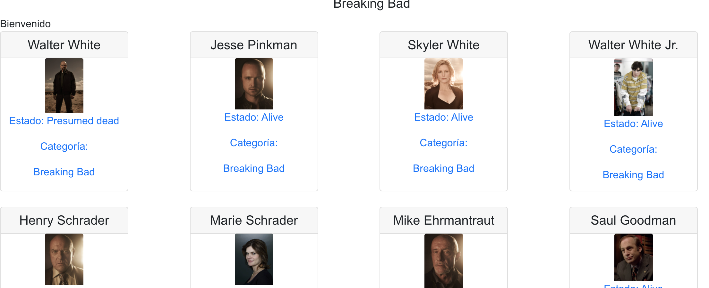
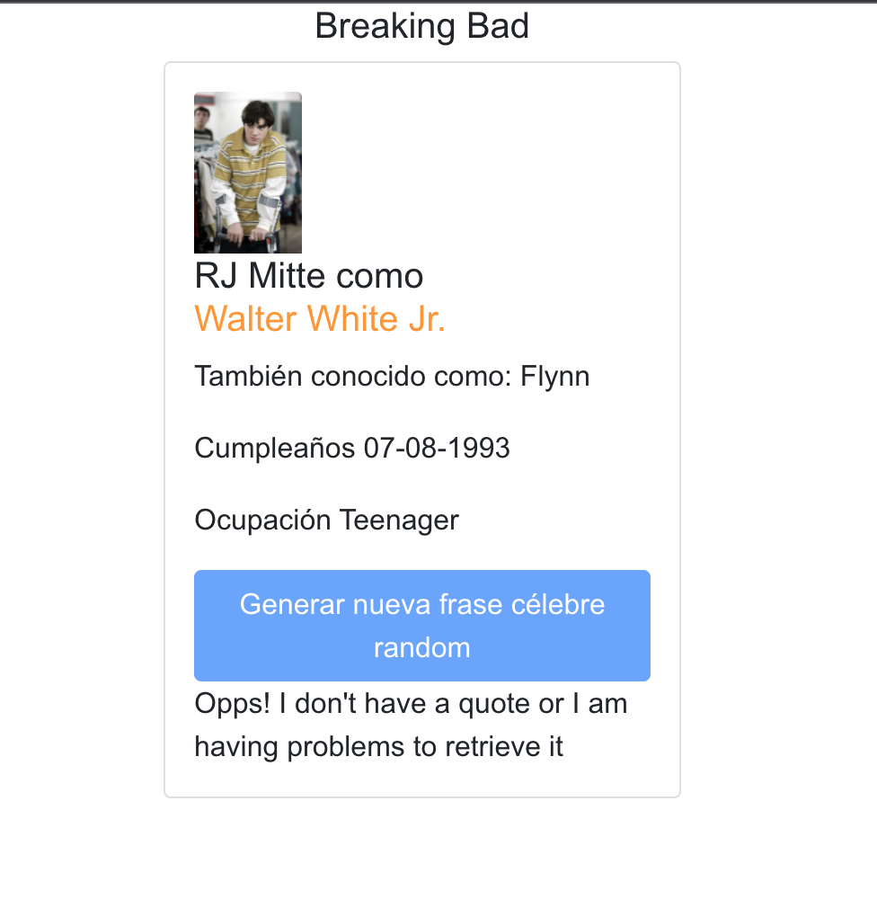
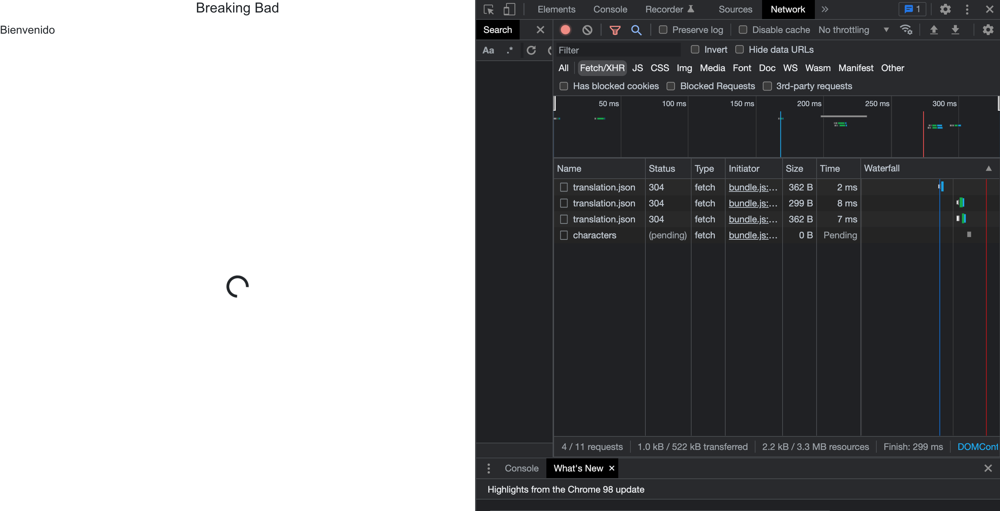
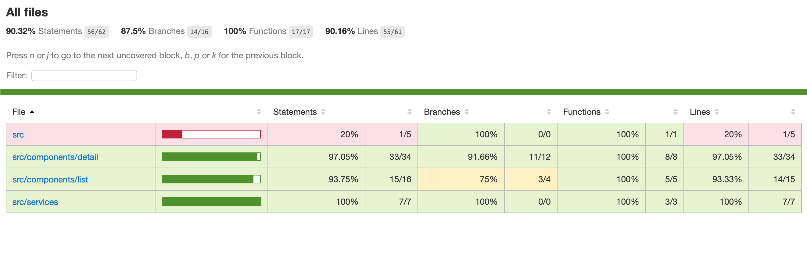

# Getting Started with Breaking Bad App
# Libraries of the project

This project was developed with the next technologies.
First, I generated a new project with create react app so I could use all the benefits from this framework.

Second, I had to install react-router-dom library, as I needed to create the proper routing between all the componentes of the application.

Also, I installed react-bootstrap library so I could easly use styled components in the project. The are another useful libraries, as Bulma, Material UI, but I used this one because it was developed also from react team.
I would prefer to use styled componentes created by myself instead of libraries (as I am used to) but I didn't want to loose to much time creating visual components.

Apart from that, also use i18next library to translate the local texts used in the project. The jsons are in the public/locales route.

Also installed Typescript because I think it is really useful in the project as add an extra documentation for the future developers/reviewers and also helps to develop with better standars. I used it in some parts of my code.

Last, but not least important, I used jest to test my functionality. I will talk more deeply about testing later.

# Structure of the project

I created a basic structure for the project, as it is not too much big.

One folder called public where I added the jsons files for translations, and another one, src, where we can difference between services and components. 

In services we have a file for the three api calls that we will do: to get character list, to get the unique character in detail and to get the random quote.
I used "fetch" as I found the easiest one to use and I didn't have to install anything, but notice that I think axios is better for professional and bigger projects because, for example, has a extensive browser support, and you don't have to convert the response from api to a json object before use it in component.

In the components folder (that also could be named as pages or views, this can generate an interesting argument), we can find Detail and List.

List is about all the characters that are retrieved from the api call. Here we can read basic information about each character: Name, picture, category and status (alive or dead).

If we click in each part of the Card, we will navigate to the Detail route, where we will see a similar Card but with more information: birthday, nickname, occupation... and also a Button that, when it is clicked, generate a new random quote.
This random quote is displayed just below the button, and it is updated once the user clicks again in the button.
Notice that when the character doesn't have a quote, the button is as disabled so the user is not allowed to click it on it. Also, a informative text is shown: 

The api for the detail information for the character is triggered as soon as we launch in the page and we have the char_id value that comes from the params.

Also, important to say that App.js file is the one that has the routing logic of the project.

# Manageging errors and loadings

As we saw before, when no quote comes the character selected, I added a informative text.

Also added this error controlling for when something happens retrieving data from the each of the api calls.

![errorList]](./public/errorList.png)

Also for when apis are loading/pending, I added a simple spinner to be displayed while information is not coming from back end.

# Testing

Final bullet of the list is about testing. I tried to generate as many tests as were useful to prove that the logic of the components is stable and consistent.

For example, for List case, I proved that spinner is displayed while data is not coming (whit its styles), and also another one to prove that once we had the information, it its displayed (name, category...).

In Detail test I tested that when no api is dispatched, we have a informative text, and, once we have the information, it is displayed.
Also, when the quote is not coming, button is disabled and the opposite case.

Coverage report image:

A 90% is achived.